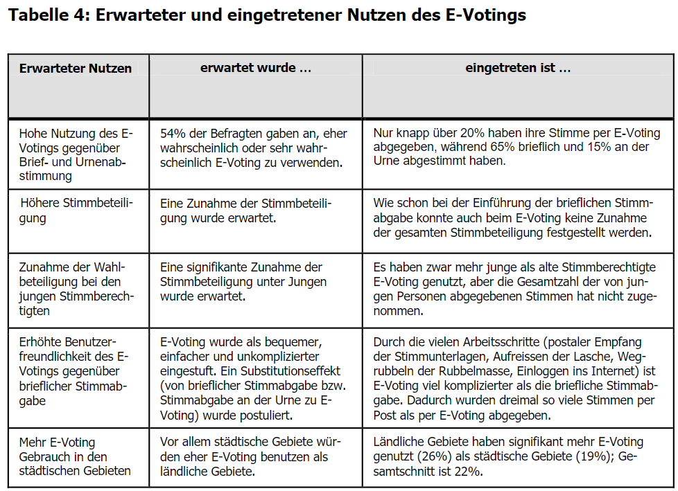
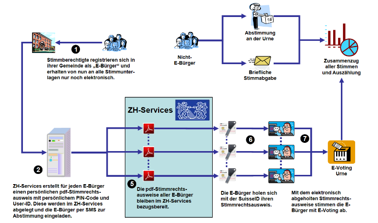

# Evaluation der E-Voting Testphase im Kanton Zürich 2008-2011

### Citation:
Beroggi, G., Moser, P., & Bierer, D. (2010). Evaluation der E-Voting Testphase im Kanton Zürich 2008-2011. Stadt Zürich.

(Beroggi et al., 2010)

### Quelle:
https://www.zh.ch/bin/zhweb/publish/regierungsratsbeschluss-unterlagen./2011/1391/Evaluation_E-Voting_Z%C3%BCrich.pdf

## Zentrale Aussagen
- 87'000 Stimmberechtige in 12 Abstimunngen optionale E-Voting Möglichkeit. 20% E-Voting / 65% Brief / 15% Urne (S.3)
- Stimmbeteiligung hat sich nicht erhöht (S.3)
- Substitution der Briefwahl (S.3)
- Bei 80% der Einsätze zu kleineren Problemen (S.3)
- Auswirkungen auf die Stimmbeteiligung. Viele Faktoren; Politische Brisanz. Gleichzeitigkeit mit Eidgenössischen Vorlagen. Im Ganzen keine systematische Unterschiede der Stimmbeteiligung im Ganzen. In einzelnen Gemeinden aber schon (S.19)
- Grosse Nutzniesser des Systems sind die Gemeinden. Müssen nicht händisch auszählen. (S.21)

## Zitate
- "In der Tendenz kann man sagen, dass die Attraktivität von E-Voting mit zunehmender Urbanität einer Gemeinde abnimmt" (S.20)
- "Der Vergleich legt nahe, dass jüngere Stimmberechtigte E-Voting wahrscheinlich etwas 
stärker nutzten als Abstimmungsteilnehmer im Pensionsalter, was ja auch plausibel ist. 
Im Lichte der obigen Ausführungen kann daraus aber nicht geschlossen werden, dass 
die Jungen deshalb wegen E-Voting öfter an Abstimmungen teilgenommen hätten; sie 
haben  nur  in  etwas  ausgeprägterem  Masse  die  traditionellen  Kanäle  durch  E-Voting 
substituiert, und die Stimmberechtigten im Pensionsalter sind einfach weniger auf die 
neue Möglichkeit des E-Votings umgestiegen. " (S.20)

## Eigene Kommentare
- Das angewandte System erscheint mir als relativ komplex und offeriert ausser der Digitisierung keinen wirklichen Vorteil für die Stimmbürger
- Es ist interessant, dass die Gemeinden oder Organisatoren der Wahlen als hauptsächliche Nutzniesser beschrieben werden.
- Die Frage bleibt offen, ob eine benutzerfreundlichere Digitalisierung des Vorgangs einen Effekt auf die Stimmbeteiligung hätte.

## Images

