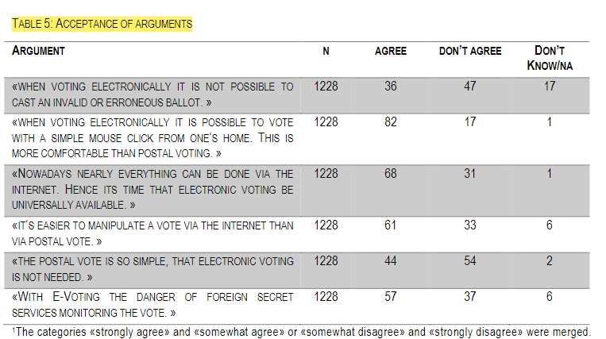

# Haltungen und Bedürfnisse der Schweizer Bevölkerung zu E-Voting

### Citation:
Milic, T., McArdle, M., Serdült, U., Glaser, A., Kübler, D., & Ziegler, B. (2016). Haltungen und Bedürfnisse der Schweizer Bevölkerung zu E-Voting = Attitudes of Swiss citizens towards the generalisation of e-voting. ZDA. https://doi.org/10.5167/uzh-127938

(Milic et al., 2016)

### Quelle:
https://doi.org/10.5167/uzh-127938

## Zentrale Aussagen
- Ängste: Möglichkeit von Manipulation und brechen des Wahlgeheimnisses (S.5)
- 41% Personen, welche die Möglichkeit hatten, haben gewählt. Entspricht etwa der normalen Wahlbeteiligung (S.6)
- Knapp 1/3 würde gemäss Angaben mehr wählen (S.6)
- Studie zeigt, dass die Nachfrage nach einem E-Voting Service doch vorhanden ist. 1/4 sehen es als absolut notwendig an (S.7)
- E-Voting hat im Moment die selbe Wahrnehmung wie die briefliche Wahl in ihren Anfängen. Damals wurde dem Kanal auch misstraut. Heute ist es der Hauptkanal. (S.9)
- Vorteile: Komfort und Flexibilität (S.9)
- Vorteile Vereinfachung des Prozesses und Erhöhung der Beteiligung (S.10)
- Nachteile: Risiko der Manipulation, Scams, Hacking (S.10)
- 24% konnten keinen Nachteil spontan nennen (S.11)
- 2/3 sind grundsätzlich für die Einführung von E-Votig. 1/3 rather or totally opossed (S.18)
- Faktoren für Pro und Kontra sind hauptsächlich Alter und Bildungsgrad (S.18)

## Zitate
- "A majority of the Swiss electorate are in favour of the introduction of E-Voting. The young especially believe that the electronic ballot should be available throughout the country. It is considered part of the digital lifestel. The digital natives are continuously growing in number - hence the demand for E-Voting SHOULD increase over time" (S.25)

## Eigene Kommentare
- Der Vorteil von Komfort und Flexibilität sticht heraus. Bei den aktuellen System ist aber fraglich, ob dieser mögliche Vorteil wirklich vollkommen ausgeschöpft wird. Der E-Voting Prozess erscheint doch in den meisten Anwendungsfällen als eher schwer und kompliziert.
- Grundsätzlich sind die meisten Personen für ein E-Voting System. Die Ängste bezüglich und Manipulation müssen und können heute technisch gelöst werden. Ein robustes System, dass aus allen möglichen Vorteilen schöpft und wirkliche Vorteile bietet sollte in Zukunft auch zu einer erhöhten Stimmbeteiligung führen.

## Images
