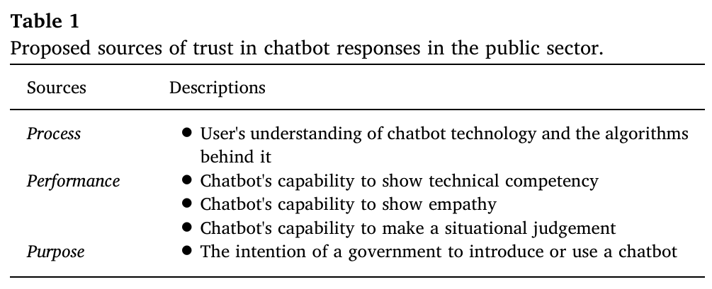

# An experimental study of public trust in AI chatbots in the public sector

### Citation:
Aoki, N. (2020). An experimental study of public trust in AI chatbots in the public sector. Government Information Quarterly, 37(4), 101490. https://doi.org/10.1016/j.giq.2020.101490

(Aoki, 2020)

### Quelle:
https://www.sciencedirect.com/science/article/abs/pii/S0740624X1930406X

## Zentrale Aussagen
- Das anfängliche öffentliche Vertrauen hängt von zwei Faktoren ab. Das Einsatzgebiet und den kommunizierten Grund für die Einführung (S.1)
- Kommuniziert der Öffentliche Dienst den Grund in Form von Vorteilen für die Bevölkerung wie die Einheit von Antworten, Qualität und Schnelligkeit, erhöht es das öffentliche Vertrauen in Chatbots (S.1)
- Definition "Public Trust" :: "Publics confidence in a machine, based on the perceived probability of its performing the work expected of it and displaying favorable behaviour" (S.1)
- Definition Chatbot :: "A chatbot is a computer program that interacts with users using natural language processing technology" (S.1)
- Manche Einsatzgründe sind leicht Vertrauensbildend (S.9)

## Zitate
- "Practically speaking, the public do not use machines if they do not initially trust them, as numerous studies on human-machine relationships suggest" (S.1)
- "will tend to trust the automation if its algorithms can be understood and seem capable of achieving the operators goals in the current situation" (S.3) 

## Eigene Kommentare
- Grundsätzlich nimmt die Bachelor-Thesis an, dass das Vertrauen in das E-Voting System vorhanden ist. Spannend wird sein, wie sich eine AI Integration darauf auswirkt.
- Wird meine Bachelor-Thesis ebenfalls interdisziplinär sein? Digitale Demokratie + User Experience + KI

## Images:

