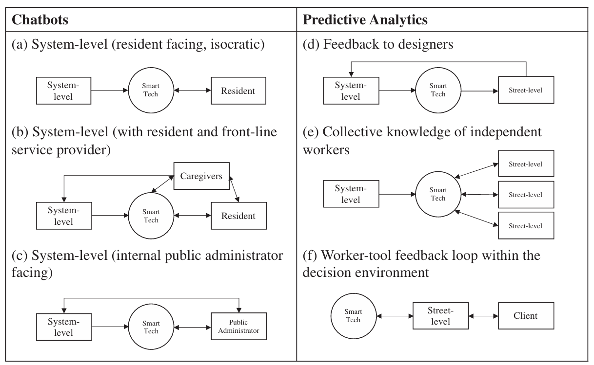

# Smart Technology and the Emergence of Algorithmic Bureaucracy: Artificial Intelligence in UK Local Authorities

### Citation:
Vogl, T. M., Seidelin, C., Ganesh, B., & Bright, J. (2020). Smart technology and the emergence of algorithmic bureaucracy: Artificial intelligence in UK local authorities. Public Administration Review, 80(6), 946–961. https://doi.org/10.1111/puar.13286

(Vogl et al., 2020)

### Quelle:
https://onlinelibrary.wiley.com/doi/full/10.1111/puar.13286

## Zentrale Aussagen
- Smart Technology Definition (S.1)
- Speaking with a chatbot at home could reduce the digital divide (S.4)
- Even a system level bureaucracy requires input from multiple parties, Suggesting that a front end that may look like an isocratic tool may in fact require significant socio-technical administrative infrastructur in order to function. (S.5)

## Zitate
- "Autonomous agents can assist citizens with their service needs, but they can also be used to help public administrators to carry out their tasks" (S.1)
- "In the end, the natural language processing only applied to the structure of the question, whilst behind the scenes the chatbot was fed by a logical workflow hand coded into the system" (S.5)

## Eigene Kommentare
- Gibt gute Einblicke was ein KI Chatbot für die Verwaltung im Hintergrund bedeutet. Die AI wird zum Gesicht einer Public Administration, allerdings bietet sich hier eine gute Chance der Bevölkerung das genaue Vorgehen zu erklären. Was passiert alles im Hintergrund? Wer ist alles involviert? Von wo kommen die Daten? Transparente Kommunikation in diesen Bereichen könnte das öffentliche Vertrauen in eine KI Integration steigern.

## Images
