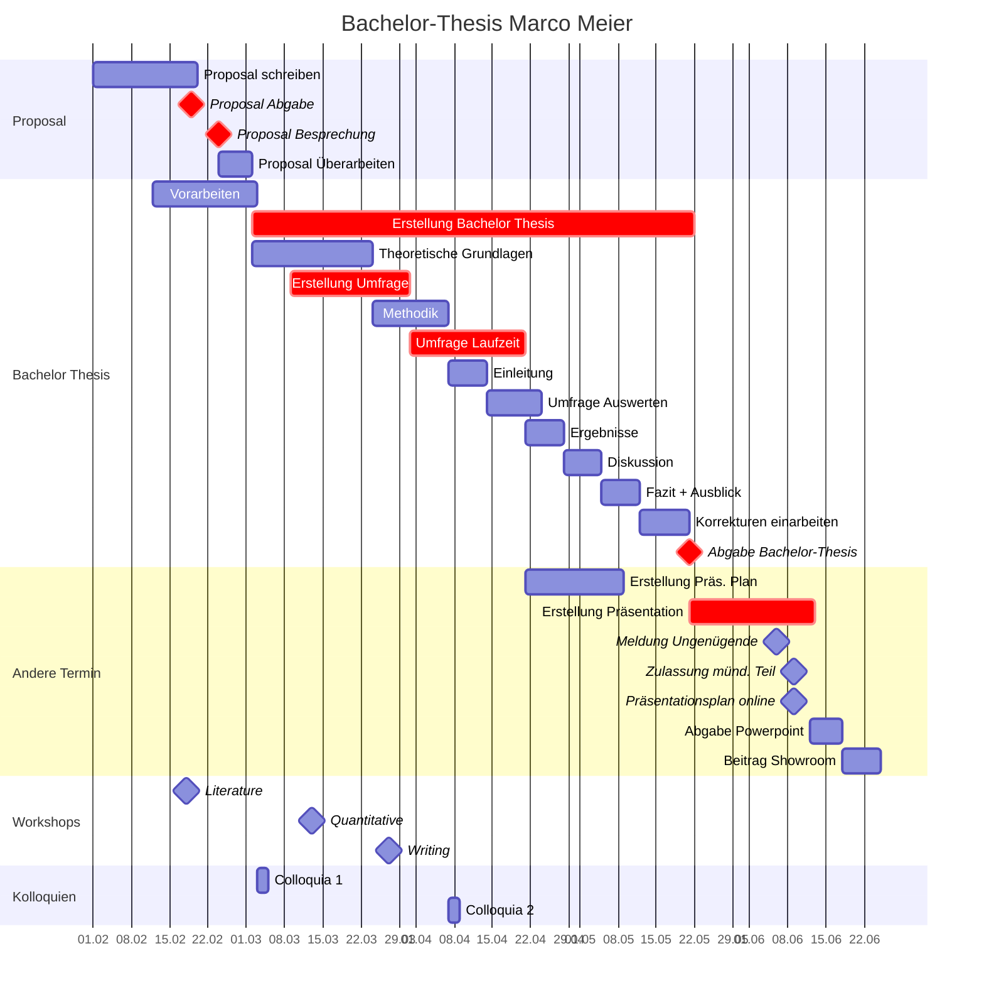

```mermaid
gantt
    title Bachelor-Thesis Marco Meier
    dateFormat DD.MM.YYYY
    axisFormat %d.%m
    tickInterval 7day
    section Proposal
        Proposal schreiben    :01.02.2025, 19d
        Proposal Abgabe       :crit, milestone, 19.02.2025, 0d
        Proposal Besprechung  :crit, milestone, 24.02.2025, 0d
        Proposal Überarbeiten :24.02.2025, 6d
    section Bachelor Thesis
        Vorarbeiten                 :12.02.2025, 19d                   
        Erstellung Bachelor Thesis  :crit, 02.03.2025, 81d
        Theoretische Grundlagen     :02.03.2025, 22d
        Erstellung Umfrage          :crit, 09.03.2025, 22d
        Methodik                    :24.03.2025, 14d
        Umfrage Laufzeit            :crit, 31.03.2025, 21d
        Einleitung                  :07.04.2025, 7d
        Umfrage Auswerten           :14.04.2025, 10d
        Ergebnisse                  :21.04.2025, 7d
        Diskussion                  :28.04.2025, 7d
        Fazit + Ausblick            :05.05.2025, 7d
        Korrekturen einarbeiten     :12.05.2025, 9d
        Abgabe Bachelor-Thesis      :milestone, crit, 21.05.2025, 0d
    section Andere Termin
        Erstellung Präs. Plan     :21.04.2025, 18d
        Erstellung Präsentation   :crit, 21.05.2025, 23d
        Meldung Ungenügende       :milestone, 06.06.2025, 0d
        Zulassung münd. Teil      :milestone, 09.06.2025, 0d
        Präsentationsplan online  :milestone, 09.06.2025, 0d
        Abgabe Powerpoint         :12.06.2025, 6d
        Beitrag Showroom          :18.06.2025, 7d
    section Workshops
        Literature    :milestone, 18.02.2025, 0d
        Quantitative  :milestone, 13.03.2025, 0d
        Writing       :milestone, 27.03.2025, 0d
    section Kolloquien
        Colloquia 1               :03.03.2025, 2d
        Colloquia 2               :07.04.2025, 2d
```